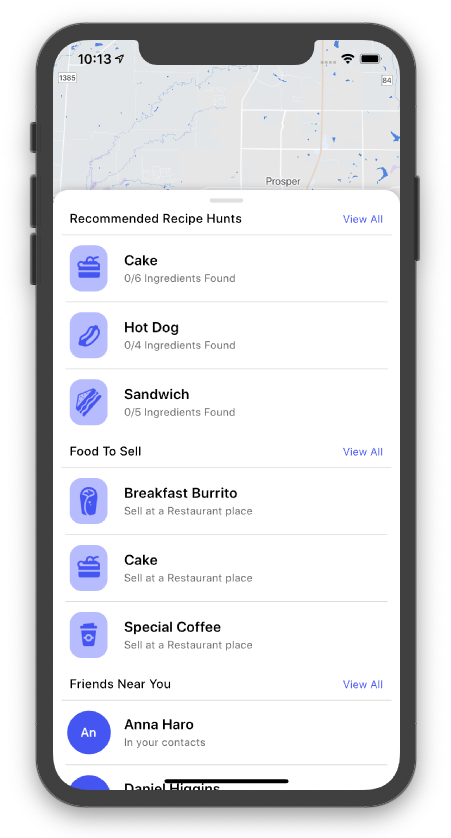

# FoodHunt

FoodHunt is an interactive geolocation “foodie” game where players become freelance
chefs in a quest to create and sell the most food items. Players follow generated recipes based on their current location to search for ingredients in the digital world, using an elegant in-game map to find their way around the real world (players have to traverse the real world by foot or vehicle). With the help of hints based on their location, players must find all the ingredients listed in a recipe to finish the quest.

## Features
Hints based on location:
 - When over 5 miles away from an ingredient, semi-transparent circles with a radius of 0.5 miles indicate the region where it may be hidden
 - When within 5 miles of the ingredient, compass directions and a spinning arrow replace the circle
- When within 0.5 miles of the ingredient, a hot/cold indicator is shown that becomes
redder the closer you get and bluer the farther you get

Sell your food for currency:
- After completing a recipe by finding all the ingerdients, the players gets a completed food item in their inventory which can be sold at a nearby restaurant, bakery, cafe or bar depending on the food type for a certain price 
- Displays directions to these sell locations, as well as additional info about the location such as reviews, ratings, photos, and price levels. 
- The price level of a restaurant is factored into the in-game sale price of the food item, incentivizing chefs to search for different restaurants

Game progress storage:
 - Every time an ingredient item is found or a food item is sold, a local SQL database is updated to persist progress

Dynamic scavnger hunt generation:
 - Rather than having a preset list of recipe hunts, when the user has below ten, more are dynamically generated with random locations
 - Random locations are human reachable as they are only chosen if they are near an actual address

## Screenshots

